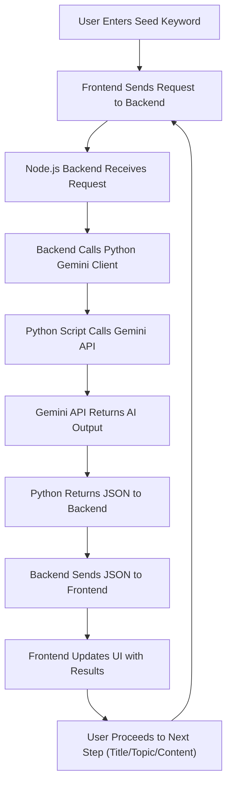

# 🧠 AI Content Writer MVP

**AI Content Writer MVP** is a full-stack application that generates SEO-optimized blog content using the **Google Gemini API**. With a simple seed keyword, the app guides users through:

- 🔍 Keyword Research  
- 📝 Title Generation  
- 📚 Topic/Outline Suggestion  
- 🧾 Content Generation  

Everything is automated and powered by AI to streamline your blogging workflow.

---

## 🚀 Features

- **Keyword Research:** AI suggests relevant keywords from a user-provided seed input.
- **Title Generation:** Creates SEO-friendly blog titles based on selected keywords.
- **Topic/Outline Creation:** Recommends outlines for chosen titles.
- **Content Generation:** Generates compelling blog introductions optimized for SEO.
- **Modern Tech Stack:** 
  - **Backend:** Node.js server integrates with a Python client for AI logic.
  - **Frontend:** React for interactive UI.
  - **AI Engine:** Python client connects to Google Gemini API.

---

## 🖼️ System Flowchart

## 🛠️ Setup & Usage

### ✅ Prerequisites

- [Python 3.11+](https://www.python.org/downloads/)
- [Node.js 18+](https://nodejs.org/)
- Google Gemini API Key
